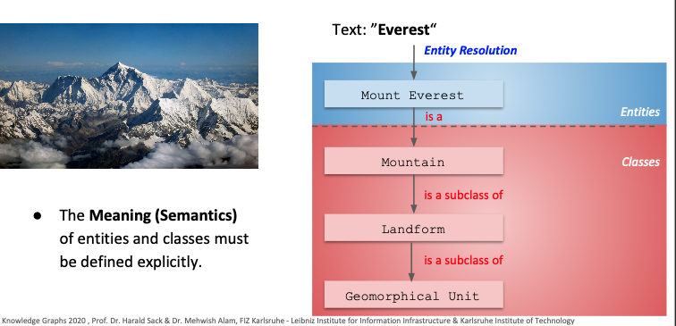
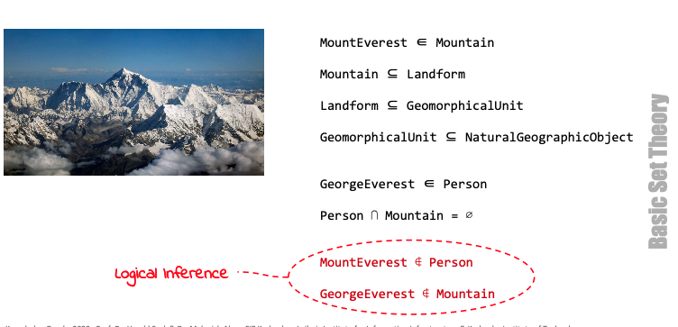
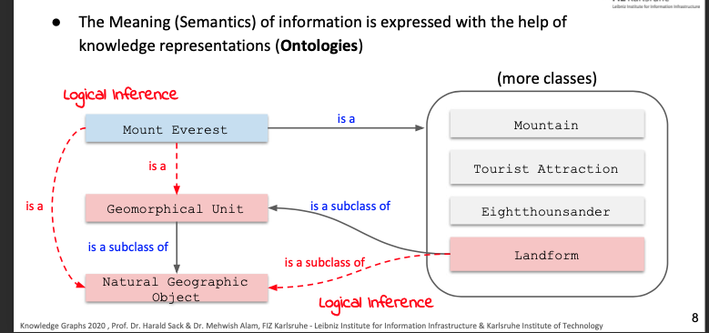
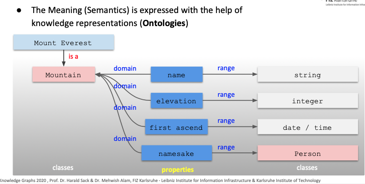
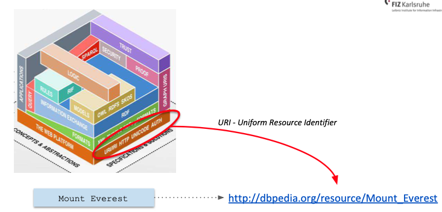
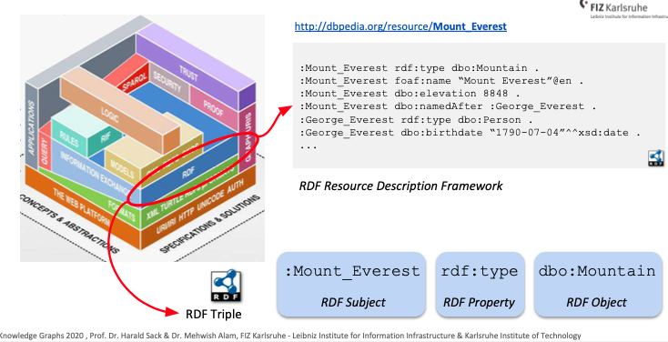
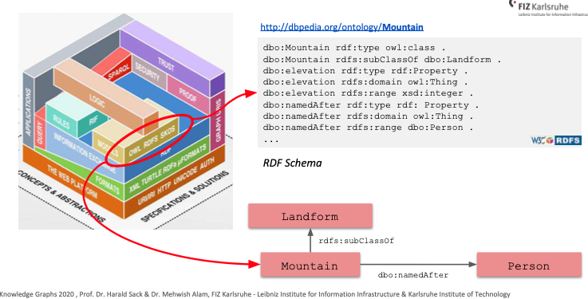
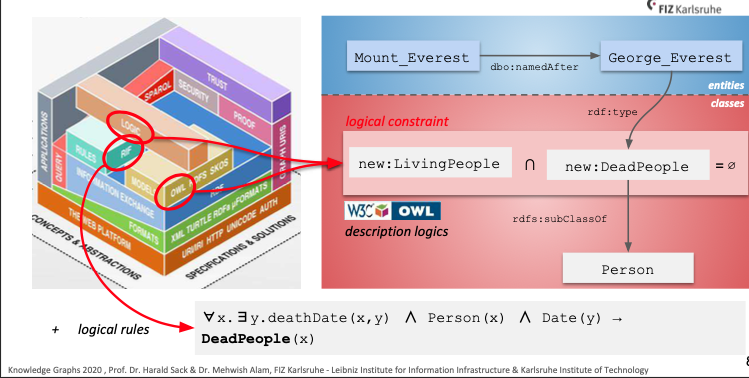
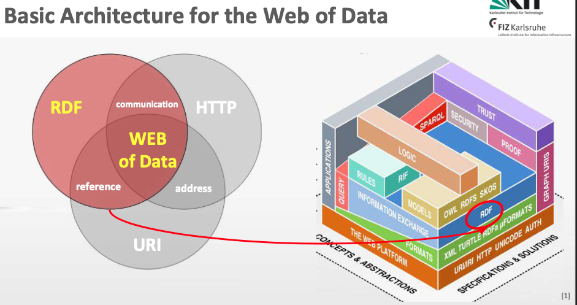

# Knowledge Graphs in the Web of Data

## Data, Information, and Knowledge

- Data: Something that exists in any raw form without having any significance of its own.
- Information: It is the data that has been given meaning by the means of relational connection. Information answers who, what, where, when, and how many.
- Knowledge: Appropriate collection of information with the intent to be useful.

Summary: Data -> Information (by convention), Information -> Knowledge (by cognition), Knowledge -> wisdom (by contemplation)

## How to Represent Knowledge?

Five steps to represent Knowledge:

1. Syntax: Common symbols and concepts
2. Semantics: use of correct syntax
3. Taxonomy: classification of concepts
4. Thesuri: associations/relations of concepts
5. rules and knowledge which relations are allowed and make sense. i.e., a person can't be alive and dead at the same time.

## The Art of Understanding

### What does it mean to "understand"?

- Information is understood by the receiver of a message, if the receiver interprets the information correctly.

#### Correct Interpretation depends on:

- Syntax: set of rules, by which well formed expressions can be created from a fundamental set of symbols
- Semantics: Interpreting the meaning of expressions
- Context: deriving meaning of a concept wrt surrounding concepts
- Pragmatics: Intent of sender (serious, irony/sarcasm)
- Experience: Previous experience.

## Towards a Universal Knowledge Representation

Using the formal representation for knowledge representation. Consider the following sentence:  
Climate Change is the Everest of all problems.

Everest -> {Everest Kansas, Everest Gasfield, George Everest, ..., Mount}
Can be resolved via entity disambiguation.

### Logical Inference over Formal Representation

  

  

## The Semantic Web

- The Semantic Web is an Extension of the current Web.
- The meaning of information (Semantics) is made explicit by formal
  **(structured)** and standardized knowledge representations **(Ontologies)**.
- The Semantic Web is kind of a global database that contains a universal
  network of semantic propositions.

### The Semantic Web Technology Stack

1. URI - Uniform Resource Identifier
   
2. RDF - RDF Resource Description Framework
   
3. RDFS - RDF Resource Description Framework Schema
   
     
   

## Linked Data and the Web of Data

### Basic Architecture of Semantic Web Data

### Linked Data Principles

1. Use URIs as names for things.
2. Use HTTP URIs, so that people can look up those names.
3. When someone looks up a URI, provide useful information, using the standards (RDF, SPARQL).
4. Include links to other URIs, so that they can discover more things.

### The Benefit of using Linked Data at BBC Website

● Information is dynamically aggregated from external, publicly available data (Wikipedia, MusicBrainz, Last.FM, Discogs,...)  
● no Screen Scraping 
● no specialized API 
● all data available as Linked Open Data 
● data access via simple HTTP Request 
● data is always up-to-date without manual interaction
